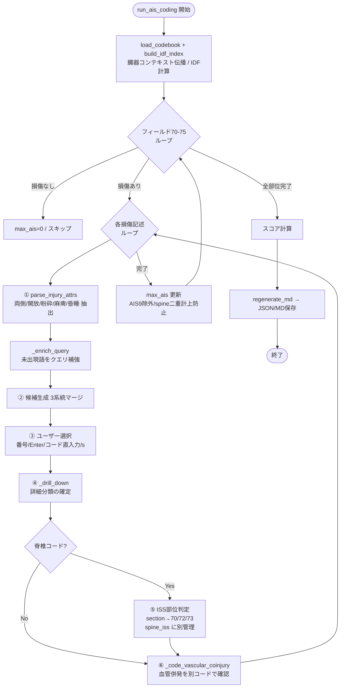
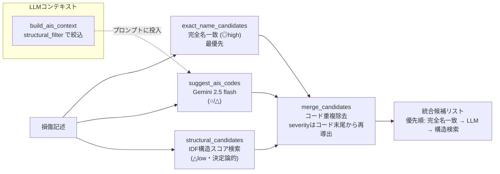
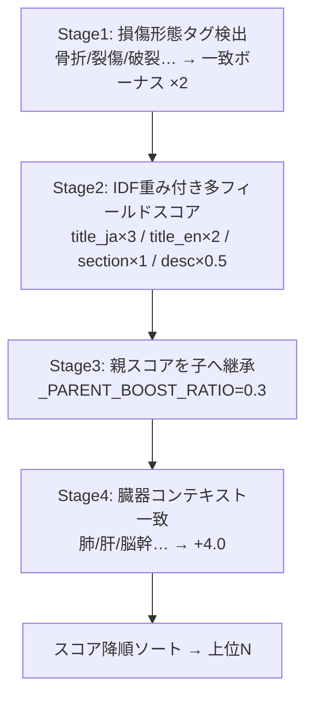
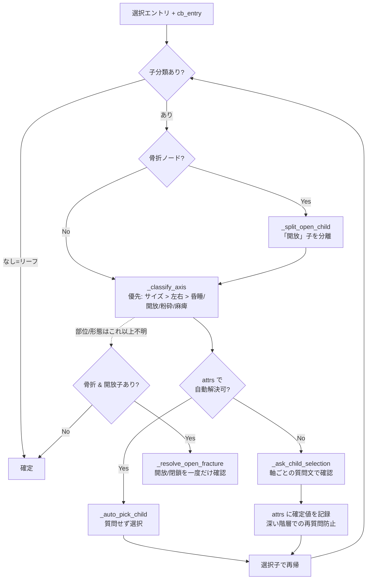
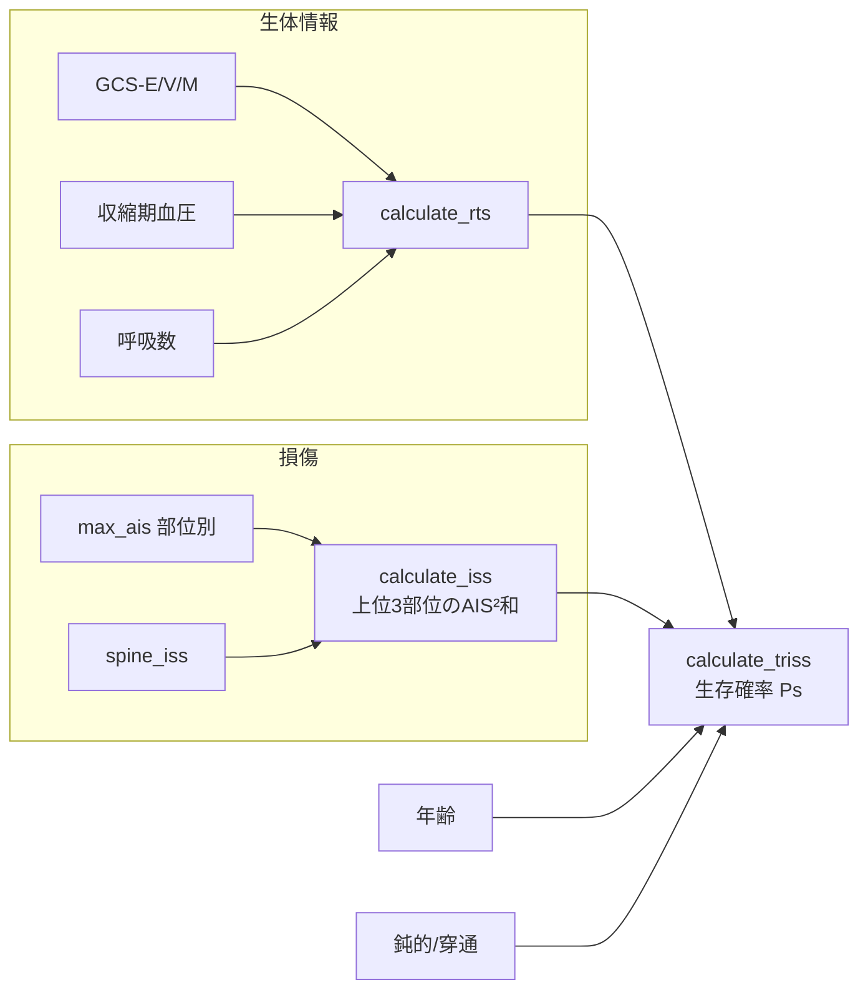

# AISコーディングの仕組み（`scripts/jtdb_ais_coder.py`）

`run_ais_coding()` を中核に、JTDB損傷フィールド（70〜75）ごとに損傷記述をループし、
各記述に対して **決定論的コードブック照合 ＋ LLM(Gemini)候補** を統合 → ユーザー確認 →
詳細ドリルダウンでAISコードを確定し、最後に ISS/RTS/TRISS を計算する。

**設計の要点**: LLMは候補提示のみで、確定は必ず決定論的照合＋ユーザー確認を経由する。
重症度はコード末尾1桁が唯一の真実（`_severity_from_code`）で、コードブックの
`ais_severity` 欄は信用しない多重防御構造。

---

## 全体フロー

---

## ② 候補生成（3系統マージ）

### 構造スコア（`structural_filter` / `_score_tree`）の4段階

---

## ④ ドリルダウン（軸判定と自動/対話確定）

---

## スコア計算の依存関係

- **ISS** = 上位3部位のAIS²の和（AIS6→75）。AIS9(不明)は除外、`spine_iss` を部位別に合算。
- **RTS** = GCS/SBP/RR のコード化値の重み付き和。
- **TRISS** = RTS・ISS・年齢・鈍的/穿通の係数から生存確率 Ps。
